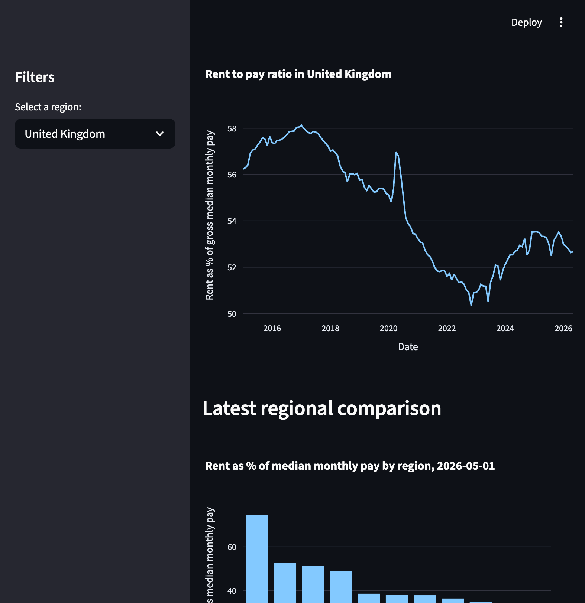

# UK Housing Affordability Analysis

## Project Overview

This project explores how private rental affordability varies across UK regions by comparing average monthly rent with gross median monthly pay.

The main affordability measure used is:

```text
Rent-to-pay ratio = average monthly rent / median monthly pay * 100

```
## Project Structure

```text
uk-affordability-analysis/
│
├── app.py
├── README.md
├── requirements.txt
│
├── data/
│   ├── raw/
│   └── processed/
│
├── notebooks/
│   ├── 01_data_collection.ipynb
│   ├── 02_data_cleaning.ipynb
│   └── 03_exploratory_analysis.ipynb
│
├── outputs/
│   └── charts/
│
└── sql/
    └── analysis_queries.sql

```
## Research Questions

- Which UK regions currently have the highest rent-to-pay ratios?
- Have rents grown faster than wages over time?
- Which regions have experienced the largest change in affordability pressure?
- How has rental affordability changed since January 2020, during the period of faster inflation and post-pandemic housing market pressure?

## Tools Used

- Python
- pandas
- matplotlib
- plotly
- Streamlit
- Git/GitHub

## Data Sources

- Office for National Statistics: Price Index of Private Rents
- Office for National Statistics: PAYE Real Time Information median pay data

## How to Run the Dashboard

Install the required packages:

```bash
pip install -r requirements.txt
```

## Key Findings

- London has the highest rent-to-pay ratio in the latest period, showing the greatest affordability pressure.
- Regional rent levels vary significantly, but comparing rent with median monthly pay gives a clearer affordability picture than rent alone.
- The rent-to-pay ratio has changed over time, suggesting that affordability pressure has not moved evenly across all UK regions.

## Conclusions

- London remains the least affordable region.
- Regional affordability pressure varies a lot.
- Nominal rents rose sharply, but gross pay also rose.
- Some regions may of seen affordability improve by the specific rent-to-gross-pay metric.
- Gross pay is not disposable income, so real-world affordability may still feel worse.

## Preview of dashboard
